

Not your typical study app!

**JeffreyWooStudy** is an AI-powered learning assistant that helps you cut study time in half by turning your materials into personalized flashcards, quizzes, study guides, and mindmaps. It combines intelligent tutoring, personalized learning paths, and interactive study support to enhance education and corporate training, and enables students and staff to upskill effectively, driving measurable improvements in study performance, adaptability, and workforce productivity.

## ✨ What It Does
- 📄 **Instant Conversion** — upload your study materials (.txt) or your photos/screenshots for your notes, and get AI‑generated flashcards, summaries, and practice questions  
- 🧠 **Evidence‑Based Learning** — built on active recall and spaced repetition to maximize retention       
- 🎙️ **AI Tutor Mode** — ask questions, get clear explanations, and test your knowledge instantly  
- 🌍 **Multilingual Support** — study in multiple languages with accurate understanding and translation  
- 🔗 **Seamless Export** — save study sets as notes and mindmaps (visual, numbered, mermaid) 

## 🚀 Why Choose JeffreyWooStudy
Most apps just digitize your notes. **JeffreyWooStudy** goes further — embedding AI into your study workflow so you can learn smarter, retain more, and feel confident faster. Every feature is designed to align with how the human brain learns best.

## 🤖 Tech Stack
- **Language** — TypeScript, HTML  
- **Framework** — React (with Vite as the build tool)  
- **UI** — Standard React components, styled via TSX
- **Runtime** — Node.js

## ✏️ Learning Theories Applied
This app integrates learning science theories into AI-driven flashcards and quizzes. It adapts to learner progress, reinforcing knowledge retention and promoting long-term mastery:  
- **Spaced Repetition Theory** — The app schedules flashcards based on the Ebbinghaus Forgetting Curve, ensuring learners review material at optimal intervals to strengthen memory consolidation.  
- **Active Recall Principle** — Quizzes are designed to force retrieval practice, a method proven to enhance long-term retention compared to passive review.  
- **Constructivist Learning Theory** — Learners build knowledge progressively; the app scaffolds questions from simple recall to complex application, mirroring Vygotsky’s “Zone of Proximal Development.”  
- **Bloom’s Taxonomy** — Question generation spans multiple cognitive levels: remembering, understanding, applying, analyzing, and evaluating, ensuring comprehensive skill development.  
- **Metacognition & Self-Regulated Learning** — The app provides feedback loops, encouraging learners to reflect on their performance and adjust study strategies.  
- **Dual Coding Theory** — Flashcards combine text with visuals, leveraging both verbal and non-verbal channels to improve comprehension and recall.  
- **Cognitive Load Theory** — Content is chunked into manageable units, preventing overload and maximizing working memory efficiency.

## 💡Finance Transformation Impact
This project demonstrates how innovation can reshape education and staff talent development by:  
- Digitizing finance learning workflows with AI‑driven tutoring and personalized study paths, enabling scalable mastery of accounting, audit, tax standards, etc.  
- Enhancing staff adaptability and productivity through interactive dashboards & tailored insights that strengthen audit readiness and financial analysis capabilities.  
- Driving organizational transformation by enabling scalable and AI‑powered upskilling for finance teams, accountants, auditors, and tax professionals.  
- Improving learning engagement and retention with interactive tools such as flashcards, quizzes, explanations & mindmaps tailored to accounting, tax, and compliance training and other studies.  
- Promoting responsible innovation by ensuring secure handling of learning data and maintaining compliance‑aligned and ethically designed training environments.

## ⭐ Finance Skills Strengthened
- Full‑stack architecture for AI‑driven financial learning applications.  
- Secure handling of sensitive study data aligned with audit standards.  
- AI model integration into education workflows (flashcards, quizzes, explanations & mindmaps).  
- File parsing & structured data transformation for financial insights.  
- Interactive dashboards with React (TypeScript + Vite) to visualize learning progress in finance.

## 📦 Getting Started
1. Upload your study materials (.txt) or photos/screenshots for your notes.  
2. Let **JeffreyWooStudy** transform them into personalized study tracks.  
3. Review, recall, and retain with AI‑powered flashcards, quizzes, study guides, and mindmaps.  

## ⚖️ Disclaimer
**JeffreyWooStudy** provides AI‑driven insights for educational purposes only. It does not replace professional academic instruction.

## ⚙️ Run Locally

**Prerequisites:**  Node.js

1. Install dependencies:
   `npm install`
2. Set the `VITE_API_KEY` in [.env](.env) file after you create [.env](.env) file
3. Run the app:
   `npm run dev`

## 📋 Sample

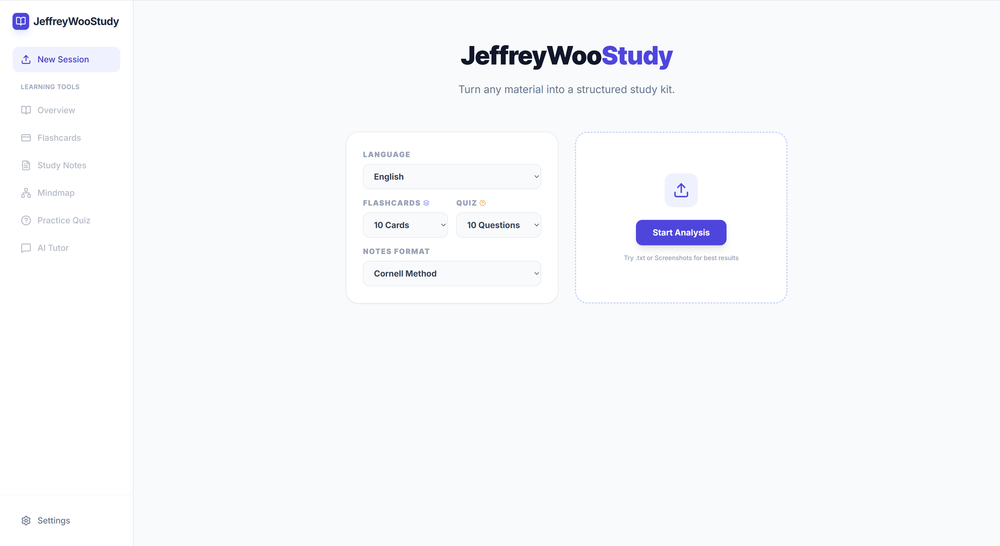
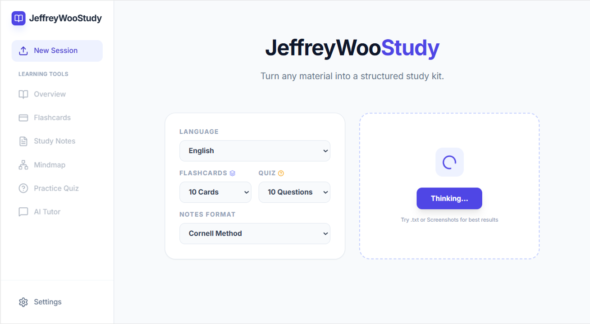

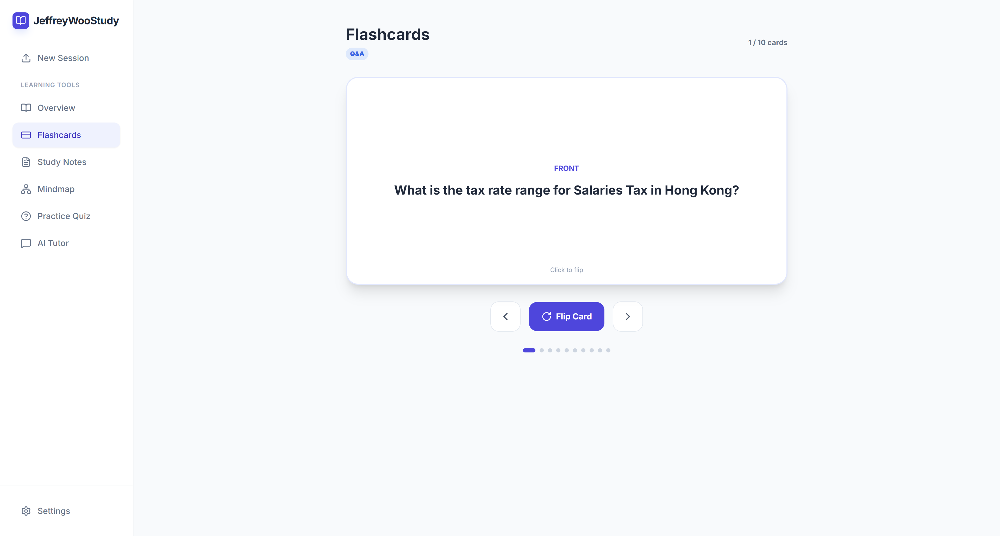
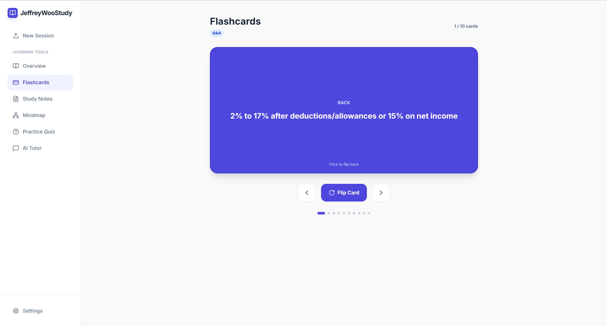
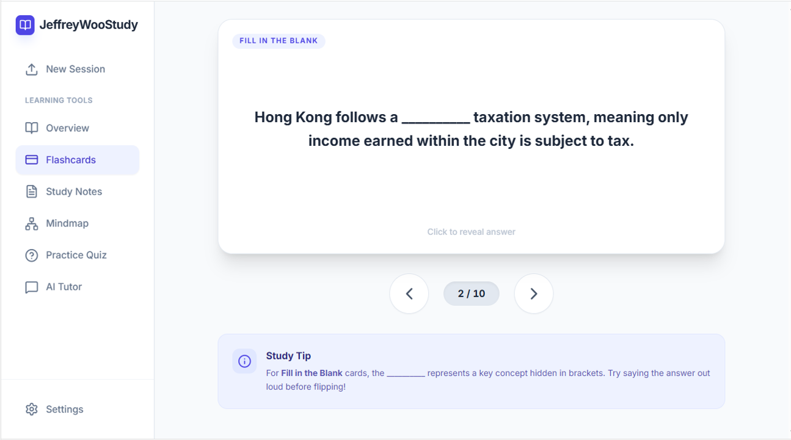
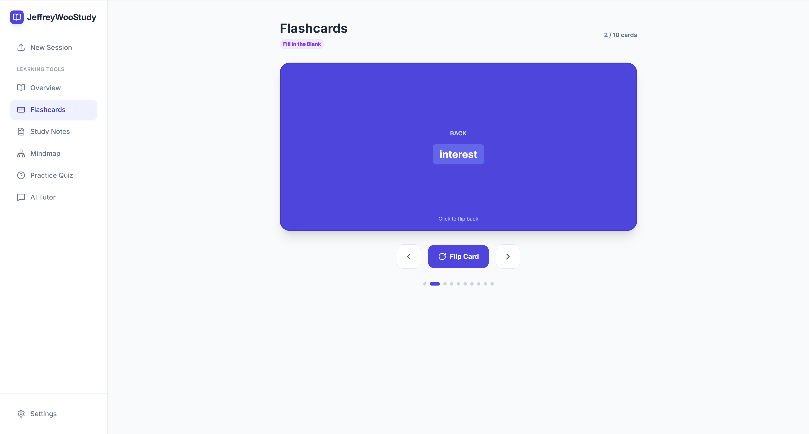
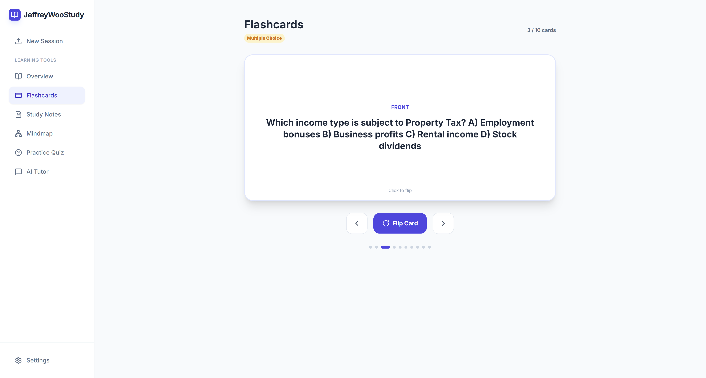
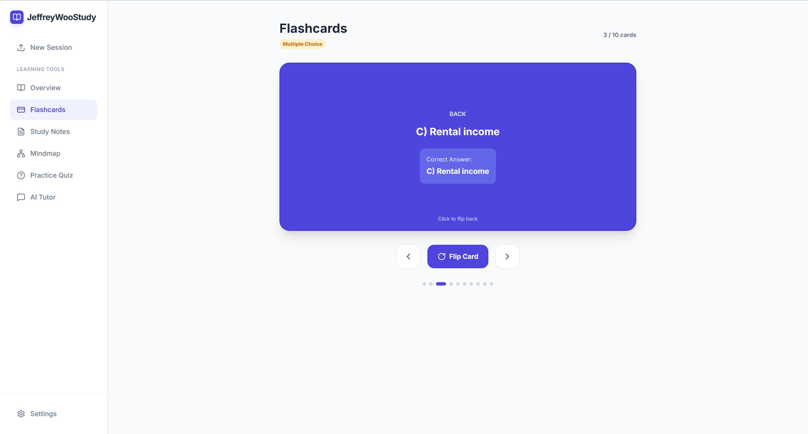
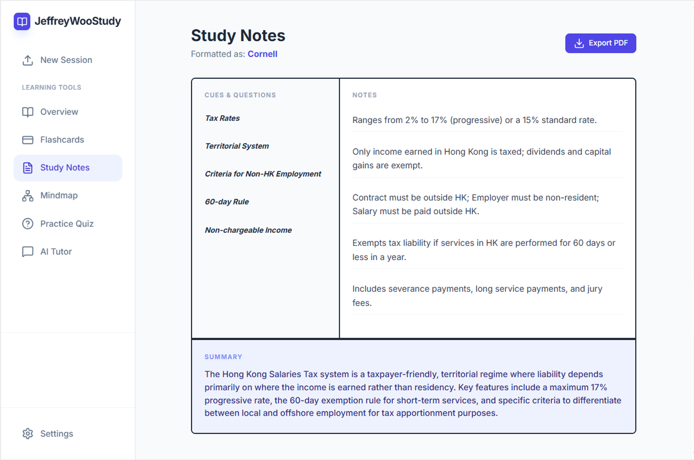

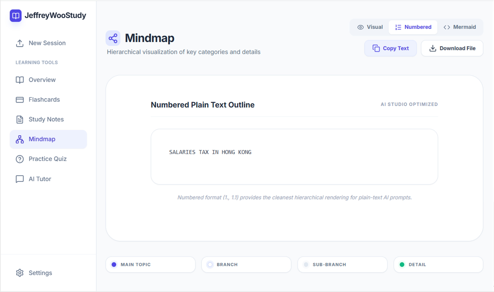
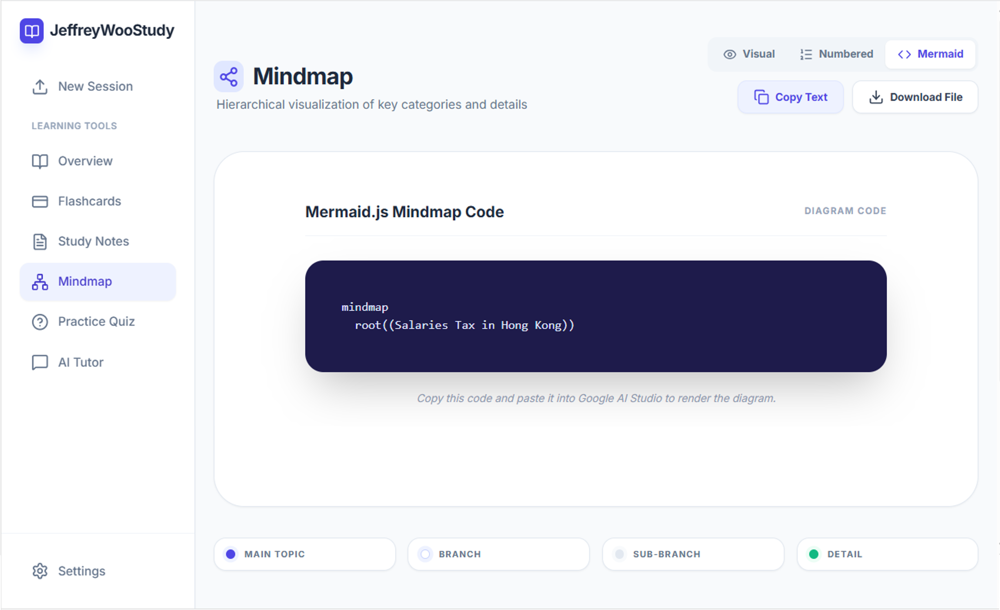
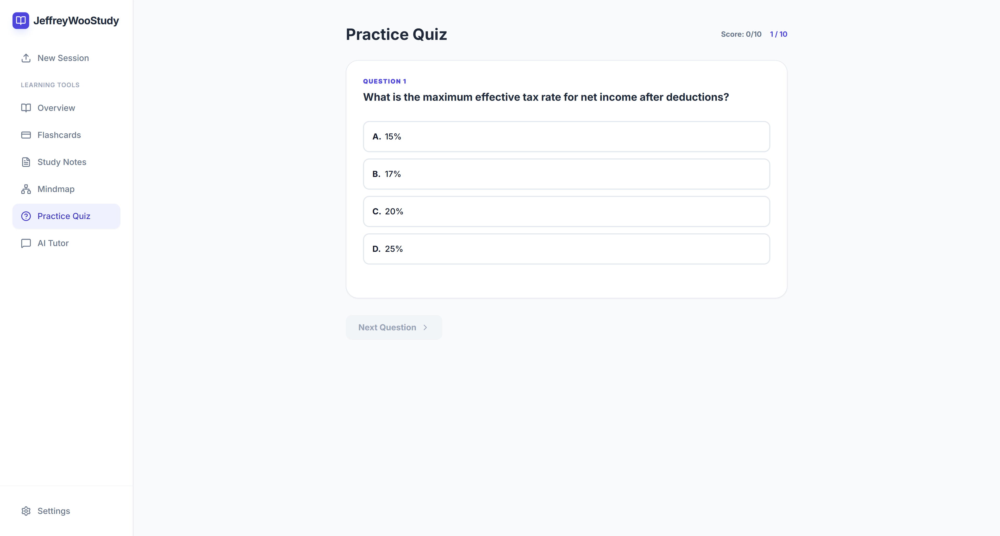
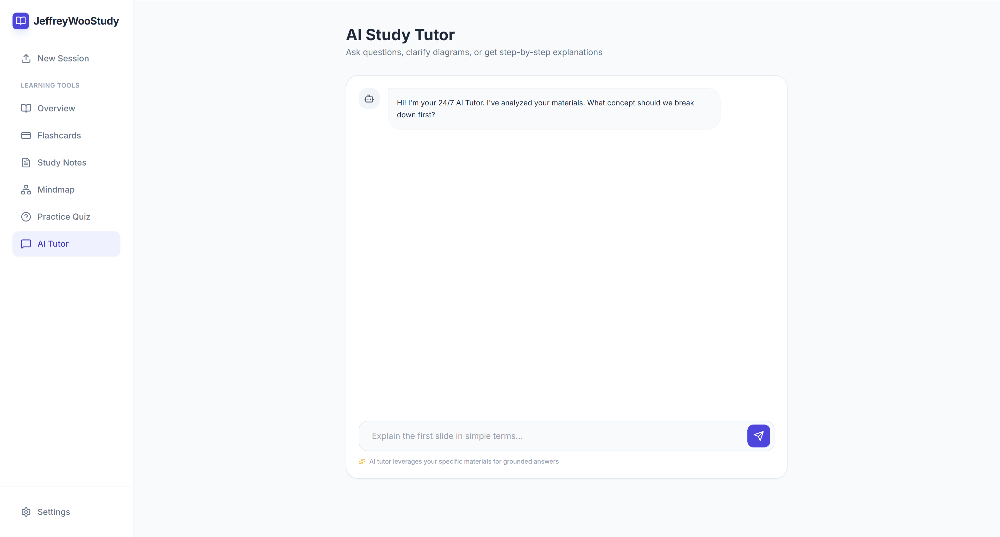
