

## 📊 Overview

> **Not your typical study app!**

**JeffreyWooStudy** is an AI-powered learning assistant that helps you cut study time in half by turning your materials into personalized flashcards, quizzes, study guides, and mindmaps. It combines intelligent tutoring, personalized learning paths, and interactive study support to enhance education and corporate training, and enables students and staff to upskill effectively, driving measurable improvements in study performance, adaptability, and workforce productivity.

## ✨ What It Does
- 📄 **Instant Conversion** — upload your study materials (.txt) or your photos/screenshots for your notes, and get AI‑generated flashcards, summaries, and practice questions  
- 🧠 **Evidence‑Based Learning** — built on active recall and spaced repetition to maximize retention       
- 🎙️ **AI Tutor Mode** — ask questions, get clear explanations, and test your knowledge instantly  
- 🌍 **Multilingual Support** — study in multiple languages with accurate understanding and translation  
- 🔗 **Seamless Export** — save study sets as notes and mindmaps (visual, numbered, mermaid) 

## 💡Finance Transformation Impact
This project demonstrates how innovation can reshape education and staff talent development by:  
- Digitizing finance learning workflows with AI‑driven tutoring and personalized study paths, enabling scalable mastery of accounting, audit, tax standards, etc.  
- Enhancing staff adaptability and productivity through interactive dashboards & tailored insights that strengthen audit readiness and financial analysis capabilities.  
- Driving organizational transformation by enabling scalable and AI‑powered upskilling for finance teams, accountants, auditors, and tax professionals.  
- Improving learning engagement and retention with interactive tools such as flashcards, quizzes, explanations & mindmaps tailored to accounting, tax, and compliance training and other studies.  
- Promoting responsible innovation by ensuring secure handling of learning data and maintaining compliance‑aligned and ethically designed training environments.

**Note:** When applying Bloom's Taxonomy to generate questions, it can target complex accounting standards such as 'Consolidated Financial Statements Preparation' or 'HKFRS 17 Insurance Contracts' by designing practice questions across different cognitive levels—from 'remembering' to 'evaluating'—to accelerate accounting professional mastery.

## 🚀 Why Choose JeffreyWooStudy
Most apps just digitize your notes. **JeffreyWooStudy** goes further — embedding AI into your study workflow so you can learn smarter, retain more, and feel confident faster. Every feature is designed to align with how the human brain learns best.

## ✏️ Learning Theories Applied
This app integrates learning science theories into AI-driven flashcards and quizzes. It adapts to learner progress, reinforcing knowledge retention and promoting long-term mastery:  
- **Spaced Repetition Theory** — The app schedules flashcards based on the Ebbinghaus Forgetting Curve, ensuring learners review material at optimal intervals to strengthen memory consolidation.  
- **Active Recall Principle** — Quizzes are designed to force retrieval practice, a method proven to enhance long-term retention compared to passive review.  
- **Constructivist Learning Theory** — Learners build knowledge progressively; the app scaffolds questions from simple recall to complex application, mirroring Vygotsky’s “Zone of Proximal Development.”  
- **Bloom’s Taxonomy** — Question generation spans multiple cognitive levels: remembering, understanding, applying, analyzing, and evaluating, ensuring comprehensive skill development.  
- **Metacognition & Self-Regulated Learning** — The app provides feedback loops, encouraging learners to reflect on their performance and adjust study strategies.  
- **Dual Coding Theory** — Flashcards combine text with visuals, leveraging both verbal and non-verbal channels to improve comprehension and recall.  
- **Cognitive Load Theory** — Content is chunked into manageable units, preventing overload and maximizing working memory efficiency.

## 📐Data Flow and Logic Sequence

The following diagram illustrates how the system transforms uploaded study materials into personalized learning content — from file upload through Gemini API generation (flashcards, quizzes, study guides, mindmaps), then applying spaced repetition, active recall, Bloom's Taxonomy, and cognitive load principles — applying the learning science theories described above at each stage.

> **How to read this diagram:** The flow follows 4 phases:
> 1. **Material Upload** — Text files or photos/screenshots
> 2. **AI Content Generation** — Gemini API creates flashcards, quizzes, guides, mindmaps
> 3. **Learning Science Application** — Spaced repetition, active recall, Bloom's Taxonomy, cognitive load chunking
> 4. **Interactive Study** — AI tutor mode, explanations, progress tracking, export

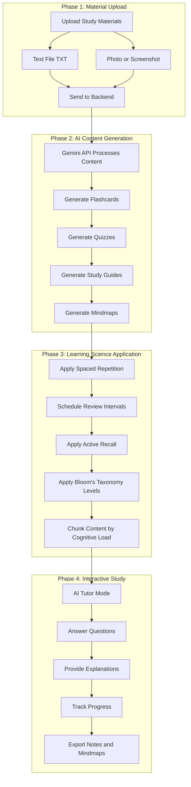
```mermaid
flowchart TD
    subgraph PHASE1["Phase 1: Material Upload"]
        direction TB
        A1["Upload Study Materials"] --> A2["Text File TXT"]
        A1 --> A3["Photo or Screenshot"]
        A2 --> A4["Send to Backend"]
        A3 --> A4
    end

    subgraph PHASE2["Phase 2: AI Content Generation"]
        direction TB
        B1["Gemini API Processes Content"] --> B2["Generate Flashcards"]
        B2 --> B3["Generate Quizzes"]
        B3 --> B4["Generate Study Guides"]
        B4 --> B5["Generate Mindmaps"]
    end

    subgraph PHASE3["Phase 3: Learning Science Application"]
        direction TB
        C1["Apply Spaced Repetition"] --> C2["Schedule Review Intervals"]
        C2 --> C3["Apply Active Recall"]
        C3 --> C4["Apply Bloom's Taxonomy Levels"]
        C4 --> C5["Chunk Content by Cognitive Load"]
    end

    subgraph PHASE4["Phase 4: Interactive Study"]
        direction TB
        D1["AI Tutor Mode"] --> D2["Answer Questions"]
        D2 --> D3["Provide Explanations"]
        D3 --> D4["Track Progress"]
        D4 --> D5["Export Notes and Mindmaps"]
    end

    A4 --> B1
    B5 --> C1
    C5 --> D1
```

## ⭐ Finance Skills Strengthened
- Full‑stack architecture for AI‑driven financial learning applications.  
- Secure handling of sensitive study data aligned with audit standards.  
- AI model integration into education workflows (flashcards, quizzes, explanations, and mindmaps).  
- File parsing & structured data transformation for financial insights.  
- Interactive dashboards with React (TypeScript + Vite) to visualize learning progress in finance.

## 🤖 Tech Stack
- **Language** — TypeScript, HTML  
- **Framework** — React (with Vite as the build tool)  
- **UI** — Standard React components, styled via TSX
- **Runtime** — Node.js

## 📦 Getting Started
1. Upload your study materials (.txt) or photos/screenshots for your notes.  
2. Let **JeffreyWooStudy** transform them into personalized study tracks.  
3. Review, recall, and retain with AI‑powered flashcards, quizzes, study guides, and mindmaps.  

## ⚙️ Run Locally

**Prerequisites:**  Node.js

1. Install dependencies:
   `npm install`
2. Set the `VITE_API_KEY` in [.env](.env) file after you create [.env](.env) file
3. Run the app:
   `npm run dev`

## 📋 Sample

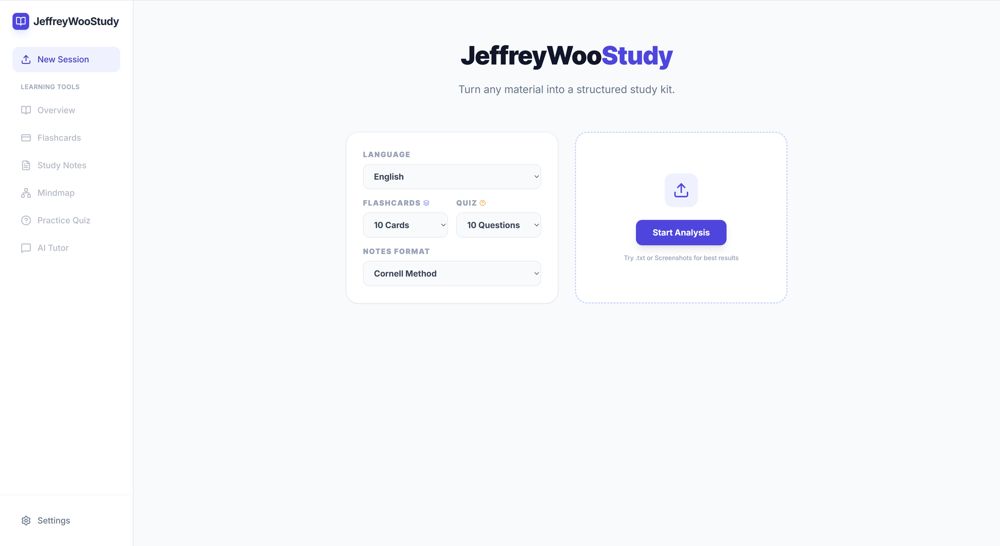
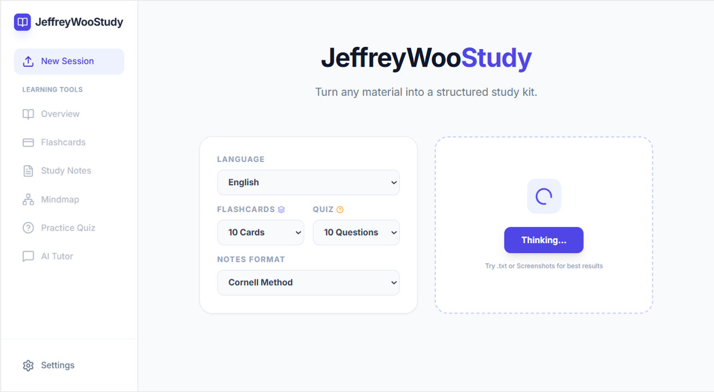

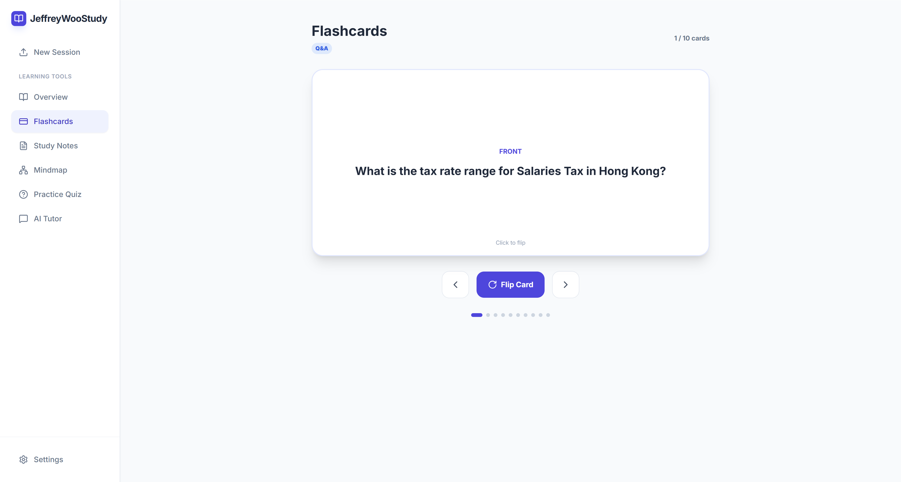
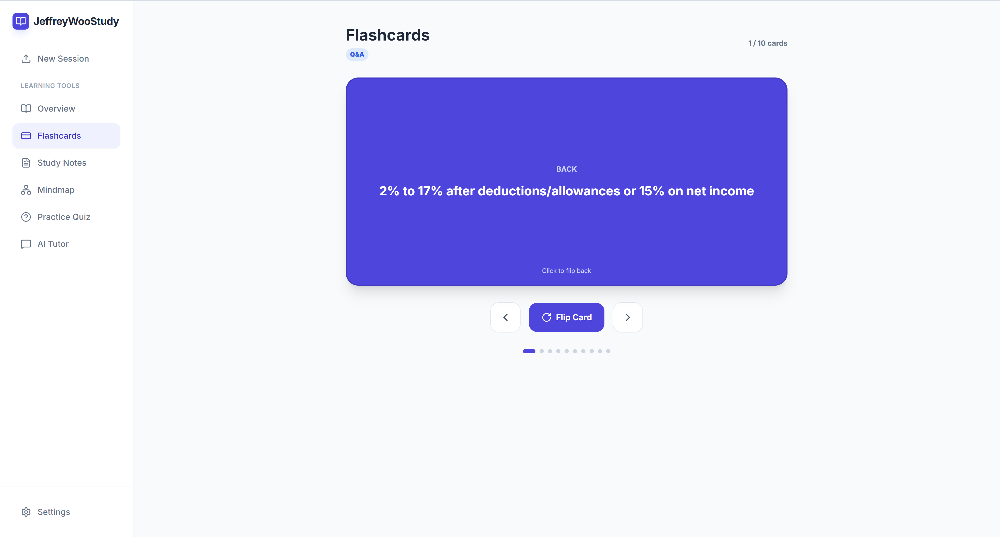
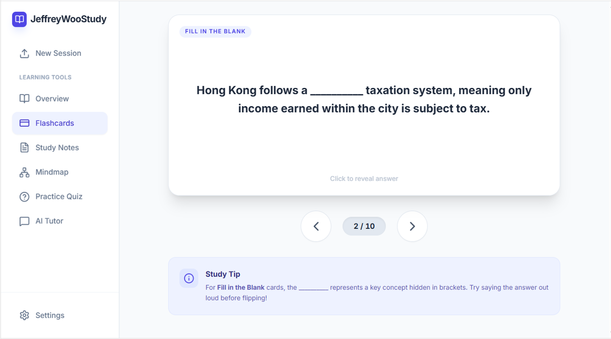
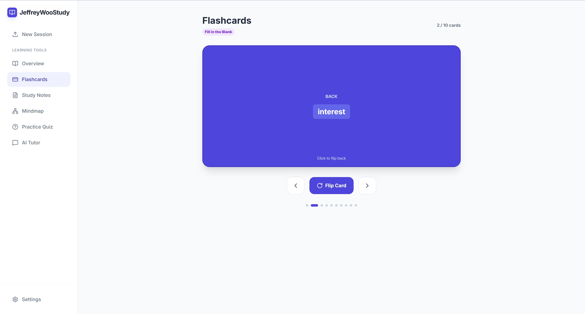
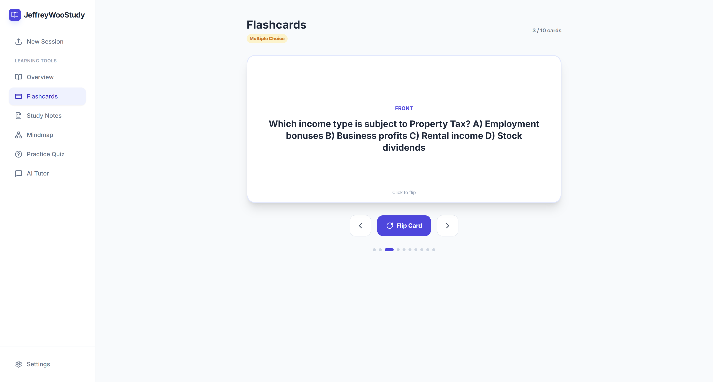
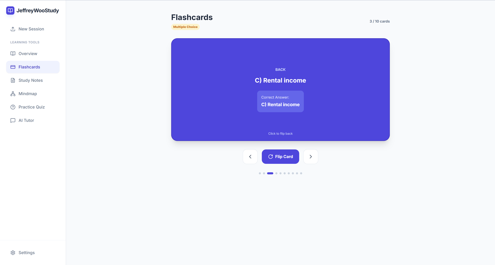
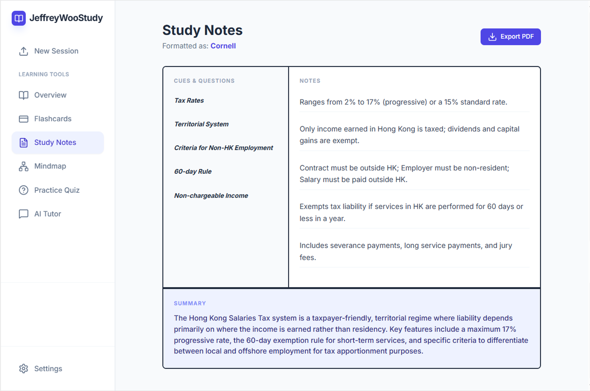

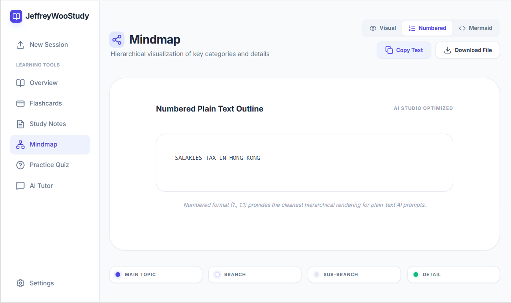
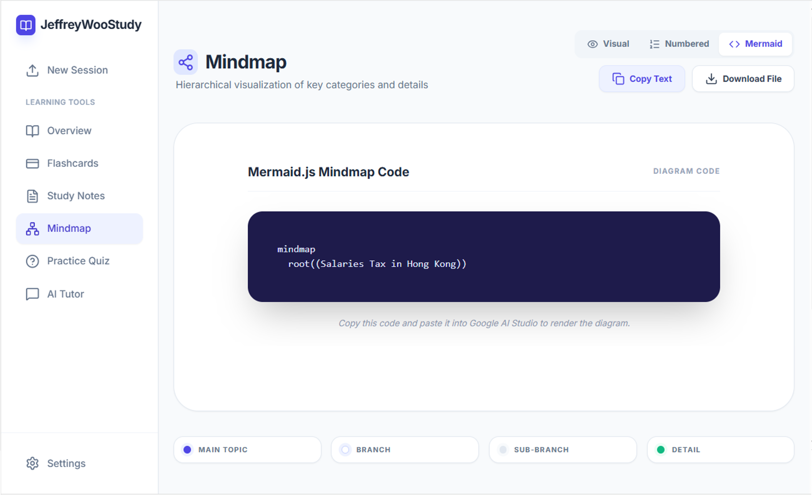
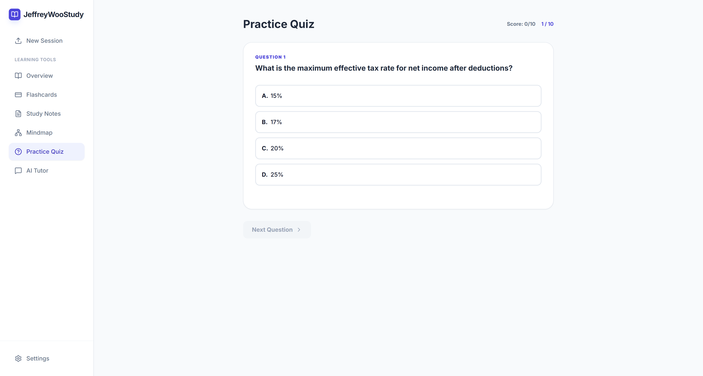
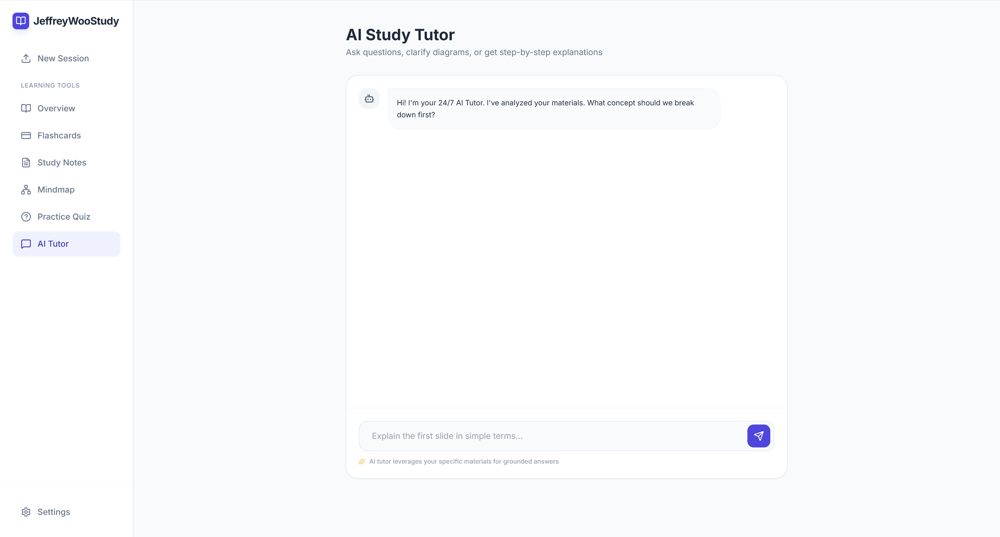

## References

**1. Learning Theories & Models**

**Spaced Repetition Theory (Ebbinghaus Forgetting Curve, ensuring learners review material at optimal intervals to strengthen memory consolidation)**

- [Ebbinghaus, H. (1885). Memory: A Contribution to Experimental Psychology (H. A. Ruger & C. E. Bussenius, Trans.). Teachers College, Columbia University. (Original work published 1885)](https://dn721504.ca.archive.org/0/items/memorycontributi00ebbiuoft/memorycontributi00ebbiuoft.pdf)

**Active Recall Principle (Quizzes are designed to force retrieval practice, a method proven to enhance long-term retention compared to passive review)**

- [Roediger, H. L., & Karpicke, J. D. (2006). Test-enhanced learning: Taking memory tests improves long-term retention. Psychological Science, 17(3), 249–255.](https://gwern.net/doc/psychology/spaced-repetition/2006-roediger.pdf)

**Constructivist Learning Theory & Zone of Proximal Development (Learners build knowledge progressively, the app scaffolds questions from simple recall to complex application, mirroring Vygotsky’s Zone of Proximal Development)**

- [Vygotsky, L. S. (1978). Mind in society: The development of higher psychological processes (M. Cole, V. John-Steiner, S. Scribner, & E. Souberman, Eds.). Harvard University Press. (Original work published 1934)](https://home.fau.edu/musgrove/web/vygotsky1978.pdf)

**Bloom's Taxonomy (Question generation spans multiple cognitive levels: remembering, understanding, applying, analyzing, evaluating, and creating, ensuring comprehensive skill development)**

- [Anderson, L. W., & Krathwohl, D. R. (Eds.). (2001). A taxonomy for learning, teaching, and assessing: A revision of Bloom's taxonomy of educational objectives. Longman. (Original work published 1956 by B. S. Bloom)](https://www.scribd.com/document/497489412/A-Taxonomy-for-Learning-Teaching-and-Assessing-A-Revision-of-Bloom-s-Taxonomy-of-Educational-Objectives-PDFDrive-com)

**Metacognition & Self-Regulated Learning (The app provides feedback loops, encouraging learners to reflect on their performance and adjust study strategies)**

- [Flavell, J. H. (1979). Metacognition and cognitive monitoring: A new area of cognitive-developmental inquiry. American Psychologist, 34(10), 906–911.](https://jgregorymcverry.com/readings/flavell1979MetacognitionAndCogntiveMonitoring.pdf)
- [Zimmerman, B. J. (2002). Becoming a self-regulated learner: An overview. Theory Into Practice, 41(2), 64–70.](https://people.bath.ac.uk/edspd/Weblinks/PGCES%20ULL%20articles/Learning%20to%20Learn/Zimmerman%202002%20TiP.pdf)

**Dual Coding Theory (Flashcards combine text with visuals, leveraging both verbal and non-verbal channels to improve comprehension and recall)**

- [Paivio, A. (1990). Mental representations: A dual coding approach. Oxford University Press.](https://api.pageplace.de/preview/DT0400.9780195362008_A42802291/preview-9780195362008_A42802291.pdf)

**Cognitive Load Theory (Content is chunked into manageable units, preventing overload and maximizing working memory efficiency)**

- [Sweller, J. (1988). Cognitive load during problem solving: Effects on learning. Cognitive Science, 12(2), 257–285.](https://mrbartonmaths.com/resourcesnew/8.%20Research/Explicit%20Instruction/Cognitive%20Load%20during%20problem%20solving.pdf)
- [Sweller, J., van Merriënboer, J. J. G., & Paas, F. G. W. C. (2019). Cognitive architecture and instructional design: 20 years later. Educational Psychology Review, 31(2), 261–292.](https://www.researchgate.net/publication/344435215_Cognitive_Architecture_and_Instructional_Design_20_Years_Later)

**2. Technology Stack**

**Gemini API (AI-powered content generation – processes uploaded materials to generate flashcards, quizzes, study guides, and mindmaps)**

- [Gemini Team, Google. Gemini API.](https://ai.google.dev/gemini-api/docs)

**React (with Vite) & TypeScript (Interactive dashboards to visualize learning progress, flashcards, quizzes, study guides, and mindmaps)**

- [Biasi, B. Vite: Next Generation Frontend Tooling.](https://vite.dev/)
- [Facebook Open Source. React: The Library for Web and Native User Interfaces.](https://github.com/facebook/react)

**Node.js (Backend runtime environment for the application)**

- [Node.js Foundation. Node.js® JavaScript Runtime.](https://nodejs.org/)

## ⚖️ Disclaimer
**JeffreyWooStudy** provides AI‑driven insights for informational, educational, and demonstration purposes only. It does not constitute professional tutoring, academic advice, or guaranteed learning outcomes.

AI‑generated explanations, answers, or study suggestions may contain errors, omissions, or inaccuracies. The model is not a substitute for qualified teachers, textbooks, or official course materials.

Always verify critical information with trusted academic sources or instructors. The developer assumes no liability for any academic performance issues, misunderstandings, or other damages arising from the use of this software.

Use at your own risk.

## 📄 License

**GNU Affero General Public License v3.0 (AGPL‑3.0)** — JeffreyWooStudy

- ✅ You are free to use, modify, and distribute this software, provided that any derivative works are also licensed under AGPL‑3.0.
- ✅ If you run or deploy this software over a network (e.g., as a web service), you must make the source code of your modified version available to all users who interact with it.
- ✅ This ensures transparency, collaboration, and continued open‑source availability of improvements.
- ❌ The software is provided “as is”, without warranties of any kind.

For full details, see the [LICENSE](./LICENSE) file.

## 👤 About the Author
Jeffrey Woo — Finance Manager | Strategic FP&A, AI Automation & Cost Optimization | MBA | FCCA | CTA | FTIHK | SAP Financial Accounting (FI) Certified Application Associate | Xero Advisor Certified

📧 Email: jeffreywoocf@gmail.com  
💼 LinkedIn: https://www.linkedin.com/in/wcfjeffrey/  
🐙 GitHub: https://github.com/wcfjeffrey/
